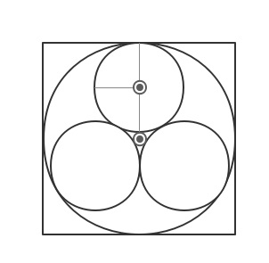
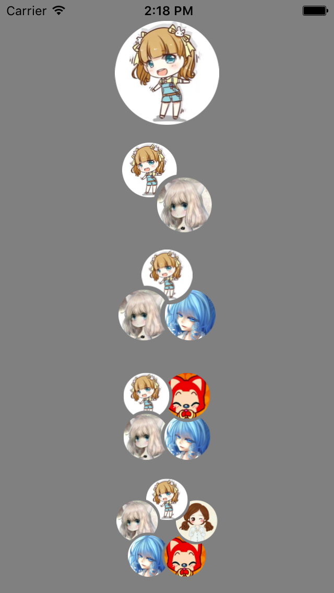

# CombinationAvatar

  去年应项目需要，要实现QQ讨论组圆形组合头像，你大爷的，国内外网站溜达了遍没找到合适，寻思怎么也要实现吧，就自己操刀试试呗，，，于是乎。
	
### 一：分析一下
  经过分析发现其实还挺简单的，既然是组合头像那咱就先拆解呗。拆解后分为都是每个圆角图片被咬掉一口，而且是按照一定角度圆形相互叠加排列，这样就好办了。

### 二：制作有缺口的圆形图片
  原本想偷懒弄几张图片叠加重行绘制就行了，后来发现绘制出来的图片模糊而且内存消耗很大效率低，尤其用户群多的时候。后来改用重新绘制的方式的到很大的改善。
image的重行绘制使用`drawRect:(CGRect)rect`，接下来的就和数学有很大的关系了，计算圆的弧度。

	// R * (cos(a) - tan(a) * sin(a))
    CGFloat angleRadius = _cycleRadius * (cos(radians(_cycleClipAngle)) - tan(radians(_cycleClipAngle)) * sin(radians(_cycleClipAngle)));
    
在指定的圆弧内进行image的重新绘制，如下：

	CGContextRef context=UIGraphicsGetCurrentContext();
    CGContextSetLineWidth(context, _cycleStroke);
    CGContextSetRGBStrokeColor(context, 1, 0, 0, 1);
    
    CGContextAddArc(context, centerPoint.x, centerPoint.y, _cycleRadius, radians(beginAngle), radians(endAngle), 1);
    
    CGPoint aPoints[2];//angle two points
    aPoints[0] =CGPointMake(centerPoint.x +_cycleRadius * cos(radians(beginAngle)), centerPoint.x + _cycleRadius * sin(radians(beginAngle)));//坐标1
        
    CGContextAddArcToPoint(context, centerPoint.x +angleRadius * cos(radians(_rotateAngle)), centerPoint.x +angleRadius * sin(radians(_rotateAngle)), aPoints[0].x, aPoints[0].y, _cycleRadius);
    
    //    CGContextDrawPath(context, kCGPathStroke);
    CGContextClosePath(context);
    CGContextClip(context);
    
    [_image drawInRect:CGRectMake(_cycleStroke / 2.0, _cycleStroke / 2.0, _cycleRadius * 2.0, _cycleRadius * 2.0)];

### 三：组装生成的每个缺口的图片
  这又是一个数学题，在指定大小的正方形内分别内部圆心相互相切与外部的正放心边框内切，是不是有点难懂，还是看图吧.这里为什么使用三个的头像作为演示呢，因为爷在这掉坑里了，三个小圆应该是正方形内切圆的内切三个小圆而不是直接是正方形的内切三个小圆：
  
  针对每个不懂数目的头像算出内切圆的半径，坐标，
  	
  	CGPoint point0 = CGPointMake(0, -radius);
    CGPoint point1 = CGPointMake(radius * -cos(radians(18)), radius * -sin(radians(18)));
    CGPoint point2 = CGPointMake(radius * -cos(radians(54)), radius * sin(radians(54)));
    CGPoint point3 = CGPointMake(radius * cos(radians(54)), radius * sin(radians(54)));
    CGPoint point4 = CGPointMake(radius * cos(radians(18)), radius * -sin(radians(18)));
    
  再然后就是计算每个子头像的旋转角度，
    
  	NSArray *angles = @[@(36 * 4),@(36 * 2),@(0),@(36 * -2),@(36 * -4)];
  	
  最终就会得到下面的效果图,是不是很简单的，目前看来这个东东还有很大的优化空间
  
  
#### [代码](https://github.com/waitingfor168/CombinationAvatar)
    

   